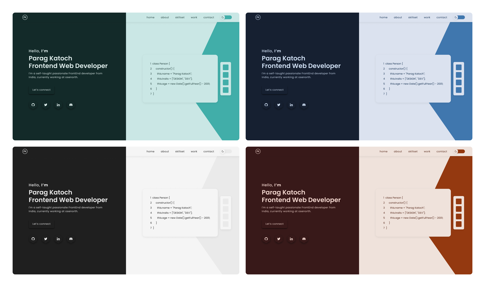

<p align="center">
  <a href="https://paragkatoch.me/">
    
    <h2 align="center">Parag Katoch</h2>
  </a>
</p> 
<h1 align="center">paragkatoch.me</h1>

This is my personal website built with NextJs and SASS. I got in inspiration of this project from [Brittany Chiang](https://brittanychiang.com/) and [Anurag Hazra](https://anuraghazra.dev/) website, kindy checkout their website as well.

This website contains 4 themes each having light and dark variants, with sections like home, about, skillset, projects and contact.

[][1]

Bored with 1 theme? Now you got 8 :D

<br/>

## 🚀 Installation & Set Up

1. Fork the repository. then clone the repo locally by doing -

   ```bash
   git clone https://github.com/paragkatoch/paragkatoch05.git
   ```

2. Install dependencies

   ```bash
   yarn install
   ```

3. Start the development server

   ```bash
   yarn dev
   ```

<br/>

## 🚀 Building and Running for Production

1. Generate a full static production build

   ```sh
   yarn build
   ```

1. Preview the site as it will appear once deployed

   ```sh
   yarn start
   ```

---

<br/>

## ⚙️ Technologies Used

1. NextJs
2. SASS for styling
3. Framer-motion of animation

<br/>

## 📂 Project structure?

    .
    ├── components
    │   ├─── About
    │   ├─── Contact
    │   ├─── ContainerHeading
    │   ├─── CustomImage
    │   ├─── Hero
    │   ├─── LogoAnimation
    │   ├─── Nav
    │   ├─── Projects
    │   ├─── Scenery
    │   ├─── SkillSet
    │   └─── Setup
    │        ├─── GoogleAnalytics
    │        └─── setTrueHeight
    ├── content
    │   ├─── assets
    │   ├─── about
    │   ├─── hero
    │   ├─── nav
    │   ├─── project
    │   ├─── scenery
    │   └─── skillSet
    ├─── context
    ├─── hooks
    ├─── pages
    ├─── public
    └─── styles

<br/>

## 🎨 Theme Reference

| Theme        | Light | Dark |
| ------------ | ----- | ---- |
| classic      | ✅    | ✅   |
| blue oon     | ✅    | ✅   |
| green goblin | ✅    | ✅   |
| red rampage  | ✅    | ✅   |

---

<br/>

## 🤝 Contributing

If you find a bug, have a suggestion, a feature request, or if you simply want to contact me, feel free to reach out !

<!-- links to your social media accounts -->

[1]: https://paragkatoch.me
[2]: https://github.com/paragkatoch
[3]: https://github.com/paragkatoch/paragkatoch05
